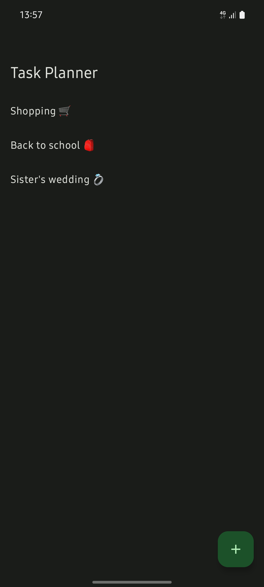

# Task Planner

Task Planner is an application that allows you create, edit, delete and sort task into categories.
It is a simple application that allows you to keep track of your tasks and their status.
Reminders can be set for tasks and completed task be marked as done.

## Getting Started

This app is not meant to be used in production. It is a simple CRUD application built to learn the
basics
of android development.

### Prerequisites

Android Studio Hedgehog or higher
Minimum SDK version 29

### Installing

Download the release apk and install on your android device.

### Screenshots

See the [docs](docs) folder for more screenshots.

## Built With

* [Android Studio](https://developer.android.com/studio) - The IDE used
* [Kotlin](https://kotlinlang.org/) - The programming language used
* [Room](https://developer.android.com/topic/libraries/architecture/room) - Persistence library
* [Coroutines](https://kotlinlang.org/docs/reference/coroutines-overview.html) - Asynchronous
  programming
* [Material 3 Design](https://material.io/) - Design language
* [Android Jetpack](https://developer.android.com/jetpack) - Android development toolkit
* [Android Navigation](https://developer.android.com/guide/navigation) - Android development toolkit
* [Android Hilt](https://developer.android.com/training/dependency-injection/hilt-android) - Android
  development toolkit

## Process

This being my first android application, I decided to follow the
recommended [android app architecture](https://developer.android.com/topic/architecture/). Following
patterns like separation of concerns, single source of truth and unidirectional data flow made the
process all the more simple.

Jetpack compose was used to build the UI. The app implements the new material 3 design language with
material you theming enabled.

Recommended android development best practices like edge to edge design, dark theme, accessibility
were followed.

Jetpack navigation was used to navigate between screens. The app uses a single activity with
multiple screens.

Data persistence was achieved using the room library. Coroutines were used to perform asynchronous
operations.
Network calls were not implemented but hope to be added in the future with the use of retrofit and a
firebase backend.

Dependency injection was achieved using the hilt library. This made it easy to inject dependencies
and not worry about the lifecycle of the objects as this would have made the learning process all
the more difficult.

## Resources

Resources used in learning android development were abundant.
The [Android Developers youtube](https://developer.android.com/) channel was also a great resource
in learning [MAD](https://developer.android.com/series/mad-skills) skills. Really Mad skills. 😂.
Guides and codelabs on their [website](https://developer.android.com/) were also a great resource.

The [kolinlang slack](https://kotlinlang.slack.com/) proved to be quintessential in obtaining help
when stuck. The community is very helpful and friendly. Even got help from an android developer at
Google 🥹.

## Challenges

The biggest challenge was learning the android development process. The android development process
is very different from web development. The learning curve was steep but the resources mentioned
above made it easier. There is a lot of boilerplate code to write and to understand just to get little done.
I understand it's been made better with the introduction of Jetpack compose. Do I want to know how it was pre-compose? No.

Version and compatibility issues were also a challenge as an update broke the functionality in another library. 

## Future Improvements

* Add network calls
* Add a backend
* Add a login system
* Add a profile page
* Add a settings page
* Add a search feature
* Add a calendar view
* Add a widget

Might not come back to this project though.

Go to [my blog](https://blog.ayitinya.me) to read more about the process

